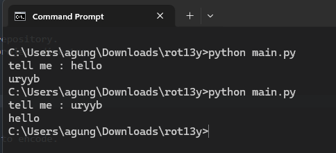

# ROT13Y

A simple ROT13 encoder written in Python. This is a small learning project created to practice basic Python concepts such as loops, strings, `ord()`, `chr()`, and modulo operations.

### Prerequisites

* Python 3.x
* No external modules or dependencies are required.

### How to run the script

1. Clone or download this repository.
2. Open a terminal in the project directory.
3. Run the script:

```bash
python main.py
```

4. Enter the text you want to encode.

Example:

```text
tell me : hello
uryyb
```

The script currently supports lowercase alphabetic characters.

### Screenshot/GIF showing the sample use of the script



## *YS4PVG*

Created by **YS4PVG**.

GitHub  : [ys4pvg](https://github.com/ys4pvg)
Linkedin: [Agung Soeltani](https://www.linkedin.com/in/agungsoeltani)
